# Inventra

Inventra adalah aplikasi manajemen inventaris untuk membantu admin toko mengelola data barang, stok, mutasi stok, dan laporan. Proyek ini menyediakan dua antarmuka yang menggunakan backend API yang sama:

- React untuk aplikasi web admin.
- Flutter untuk aplikasi mobile dan Flutter Web.

Keduanya menggunakan alur bisnis yang sama, yaitu autentikasi, dashboard, pengelolaan barang, mutasi stok, dan laporan.

## Tujuan Proyek

Proyek ini dibuat untuk:

- Memusatkan pencatatan barang dan stok.
- Memudahkan admin menambah, melihat, mengubah, dan menghapus barang.
- Mencatat barang masuk, barang keluar, opname, dan retur.
- Menampilkan kondisi stok melalui dashboard KPI.
- Menyediakan laporan barang dalam format CSV.
- Menyediakan pengalaman penggunaan yang konsisten di web dan Flutter.

Sistem menggunakan satu jenis pengguna, yaitu admin. Role tambahan seperti kasir atau manager tidak digunakan.

## Fitur

### Autentikasi

- Registrasi akun.
- Verifikasi email menggunakan OTP 6 digit.
- OTP memiliki masa berlaku 5 menit.
- Kirim ulang OTP.
- Login menggunakan JWT.
- Validasi token saat startup Flutter.
- Logout dan penghapusan sesi.

### Dashboard

- Total barang.
- Stok aman.
- Stok menipis.
- Stok habis.
- Nilai total stok.
- Total unit stok.
- Daftar barang terbaru.
- Refresh dan pull-to-refresh pada Flutter.

### Manajemen Barang

- Tambah barang.
- Lihat daftar barang.
- Edit barang.
- Hapus barang.
- Pencarian berdasarkan nama dan kode.
- Filter kategori.
- Harga satuan dan harga pak.
- Status stok Aman, Menipis, dan Habis.

### Mutasi Stok

- Barang masuk.
- Barang keluar.
- Opname stok.
- Retur barang.
- Keterangan mutasi.
- Riwayat perubahan stok.
- Nilai stok sebelum dan sesudah mutasi.
- Validasi agar stok tidak menjadi negatif.
- Update stok atomic menggunakan `$inc`.

Fitur mutasi tersedia di React dan Flutter.

### Laporan

- Export laporan barang ke CSV.
- Tombol unduh tersedia di sidebar React.
- Tombol unduh tersedia di drawer Flutter.
- Flutter Web mengunduh file melalui browser.
- Android/Desktop menyimpan file ke folder dokumen aplikasi.

## Tech Stack

### Backend

- Node.js.
- Express.js.
- MongoDB.
- Mongoose.
- JWT untuk autentikasi.
- bcryptjs untuk hashing password.
- Nodemailer untuk pengiriman OTP.
- CORS.

### React Web

- React 19.
- React Router.
- Axios.
- Lucide React.
- CSS responsive.

### Flutter

- Flutter.
- Dart.
- Provider untuk state management.
- HTTP untuk komunikasi API.
- Shared Preferences untuk penyimpanan sesi.
- Path Provider untuk penyimpanan laporan pada platform native.

## Struktur Proyek

```text
Inventra/
├── backend_inventra/
│   ├── config/
│   ├── controllers/
│   ├── middleware/
│   ├── models/
│   ├── routes/
│   ├── test/
│   ├── utils/
│   ├── server.js
│   └── package.json
├── frontend_inventra/
│   ├── public/
│   ├── src/components/
│   ├── src/pages/
│   ├── src/styles/
│   └── package.json
├── flutter_inventra/
│   ├── lib/models/
│   ├── lib/screens/
│   ├── lib/services/
│   ├── lib/widgets/
│   └── pubspec.yaml
├── start-all.ps1
└── README.md
```

## Prasyarat

- Windows PowerShell.
- Node.js dan npm.
- MongoDB lokal yang aktif pada port `27017`.
- Flutter SDK.
- Chrome jika ingin menjalankan Flutter Web.
- Git.

## Konfigurasi Backend

Buat file `backend_inventra/.env`:

```env
PORT=3000
MONGODB_URI=mongodb://127.0.0.1:27017/tokobuku
JWT_SECRET=ganti_dengan_secret_acak_yang_panjang
NODE_ENV=development
EMAIL_USER=alamat-email-anda
EMAIL_PASS=app-password-email-anda
```

Jangan commit file `.env` atau memasukkan password email dan secret JWT ke repository.

## Menjalankan Semua Aplikasi

Dari root project, jalankan:

```powershell
cd C:\laragon\www\Inventra
.\start-all.ps1
```

Launcher akan membuka tiga proses pada port tetap:

```text
Backend : http://localhost:3000
React   : http://localhost:3001
Flutter : http://localhost:3002
```

Launcher menghentikan proses lama pada port `3000`, `3001`, dan `3002` sebelum menjalankan aplikasi baru. Jangan menjalankan `npm start` backend kedua kali karena akan menyebabkan `EADDRINUSE`.

### Menjalankan Backend Manual

```powershell
cd backend_inventra
npm install
npm start
```

### Menjalankan React Manual

```powershell
cd frontend_inventra
npm install
$env:PORT='3001'
npm start
```

### Menjalankan Flutter Manual

```powershell
cd flutter_inventra
flutter pub get
flutter run -d chrome --web-port 3002
```

## Endpoint API Utama

Base URL:

```text
http://localhost:3000/api
```

Semua endpoint selain register dan login membutuhkan header:

```text
Authorization: Bearer <JWT_TOKEN>
```

### Auth

| Method | Endpoint         | Keterangan        |
| ------ | ---------------- | ----------------- |
| POST   | `/auth/register` | Registrasi akun   |
| POST   | `/auth/login`    | Login             |
| POST   | `/auth/verify`   | Verifikasi OTP    |
| POST   | `/auth/resend`   | Kirim ulang OTP   |
| GET    | `/auth/me`       | Profil user aktif |

### Barang

| Method | Endpoint         | Keterangan                                |
| ------ | ---------------- | ----------------------------------------- |
| GET    | `/barang`        | Daftar barang, search, filter, pagination |
| POST   | `/barang`        | Tambah barang                             |
| PUT    | `/barang/:id`    | Edit barang                               |
| DELETE | `/barang/:id`    | Hapus barang                              |
| GET    | `/barang/export` | Export barang ke CSV                      |

### Mutasi

| Method | Endpoint                    | Keterangan          |
| ------ | --------------------------- | ------------------- |
| POST   | `/mutasi`                   | Buat mutasi stok    |
| GET    | `/mutasi`                   | Riwayat mutasi      |
| GET    | `/mutasi/barang/:barang_id` | Riwayat satu barang |
| GET    | `/mutasi/stats`             | Statistik dashboard |

## Testing

Backend memiliki integration test untuk login, CRUD barang, mutasi, dan export laporan.

```powershell
cd backend_inventra
$env:TEST_ADMIN_EMAIL='email-admin-test'
$env:TEST_ADMIN_PASSWORD='password-admin-test'
npm test
```

Test menggunakan akun test yang sudah terdaftar dan terverifikasi. Tanpa kedua environment variable tersebut, test akan dilewati agar tidak memakai kredensial produksi secara tidak sengaja.

Validasi tambahan:

```powershell
cd frontend_inventra
npm run build

cd ..\flutter_inventra
flutter analyze
```

## Troubleshooting

### `EADDRINUSE` pada port 3000

Backend sudah berjalan. Jangan menjalankan `npm start` kedua kali. Gunakan launcher dari root project atau hentikan proses lama terlebih dahulu.

### MongoDB tidak tersambung

Pastikan MongoDB aktif dan nilai `MONGODB_URI` benar. Backend menggunakan MongoDB lokal pada port `27017` secara default.

### Flutter Web tidak dapat memanggil API

Pastikan backend berjalan di port `3000` dan Flutter dijalankan dengan:

```powershell
flutter run -d chrome --web-port 3002
```

### Export laporan gagal

Pastikan backend yang aktif sudah menggunakan source terbaru dan endpoint berikut menghasilkan `200` dengan `Content-Type: text/csv`:

```text
http://localhost:3000/api/barang/export
```

## Dokumentasi Tampilan

Screenshot aplikasi tersedia di folder [`docs`](docs/).

### Autentikasi

| Tampilan       | React                                      | Flutter                                        |
| -------------- | ------------------------------------------ | ---------------------------------------------- |
| Login          | 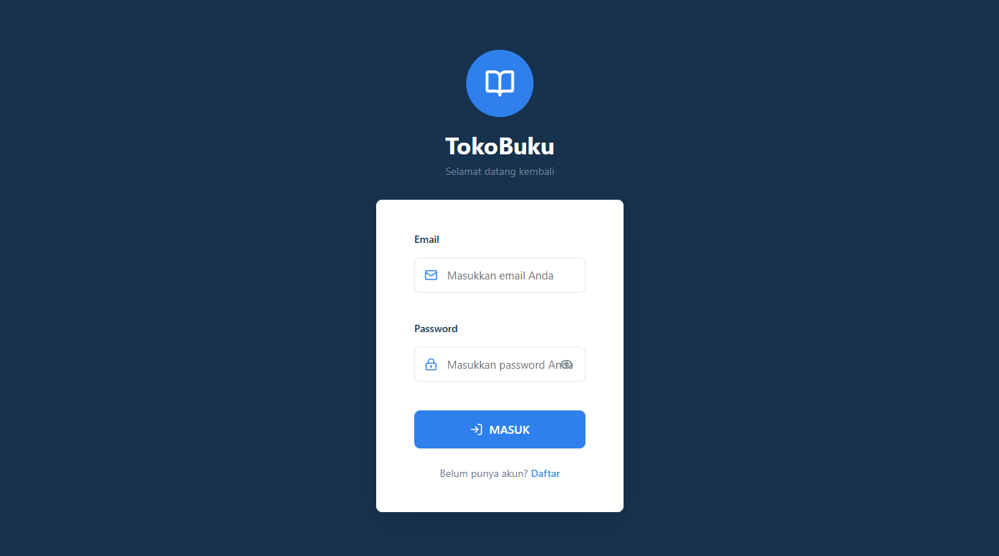       | 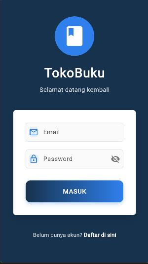       |
| Register       | 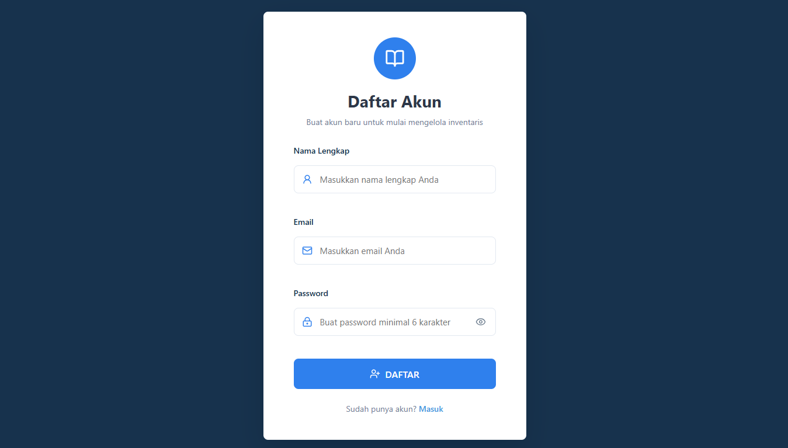 | 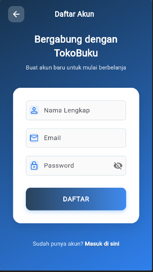 |
| Verifikasi OTP | -                                          | -                                              |

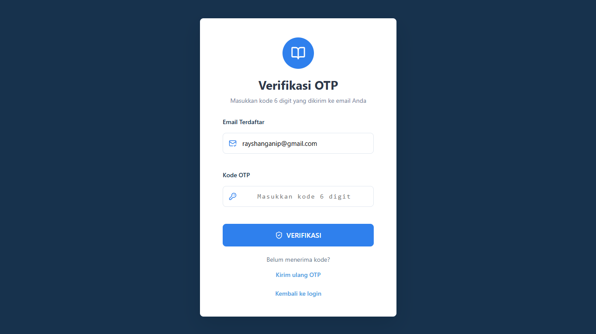

### Dashboard dan Barang

| Tampilan      | React                                                | Flutter                                                  |
| ------------- | ---------------------------------------------------- | -------------------------------------------------------- |
| Dashboard     | 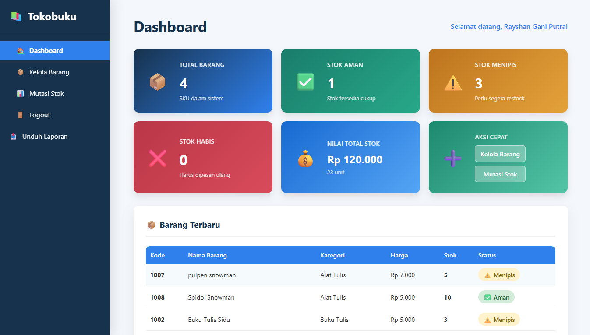         | 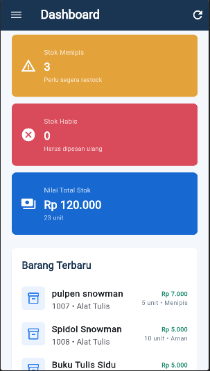         |
| Daftar Barang | 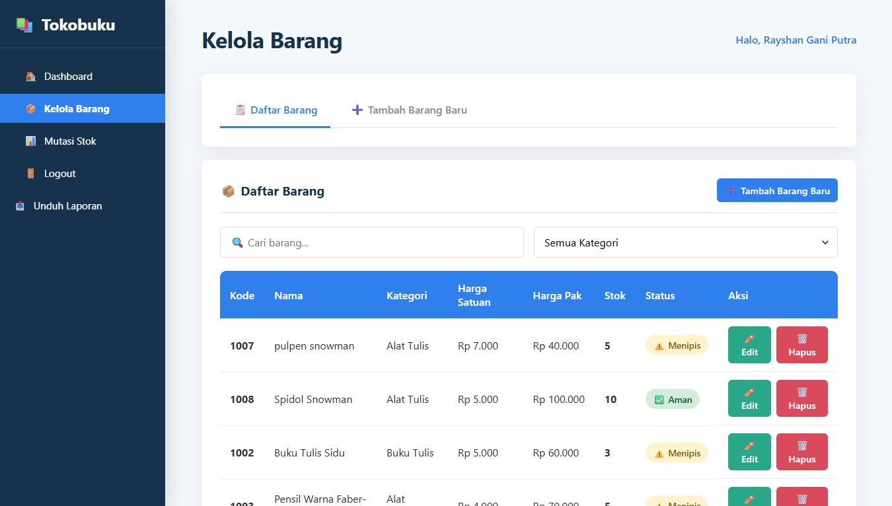 | 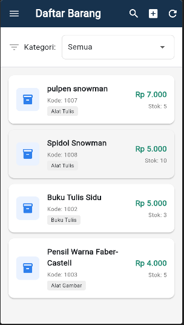 |
| Form Barang   | 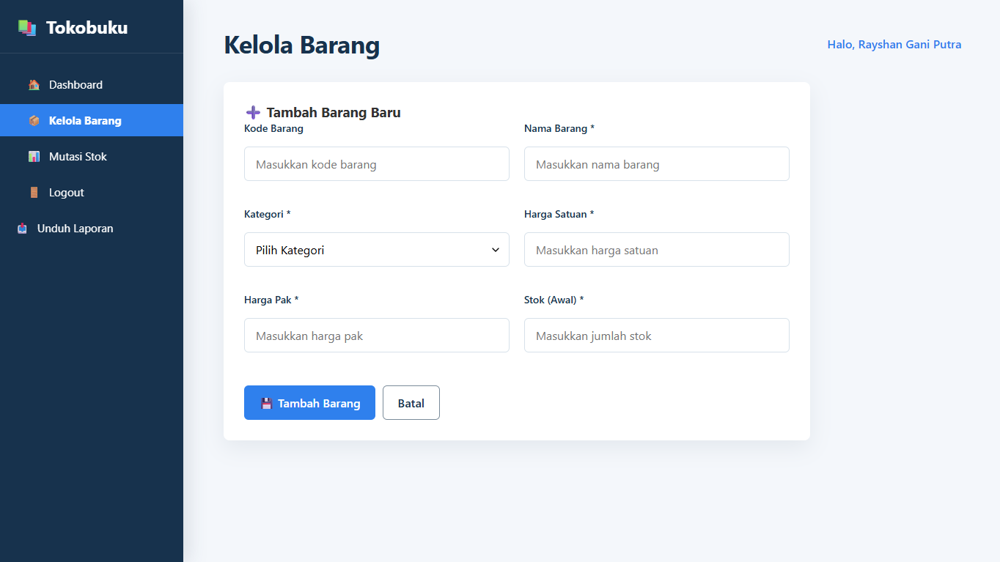   | 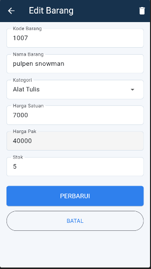       |

### Mutasi Stok

| Tampilan         | React                                            | Flutter                                                   |
| ---------------- | ------------------------------------------------ | --------------------------------------------------------- |
| Form Mutasi Stok | 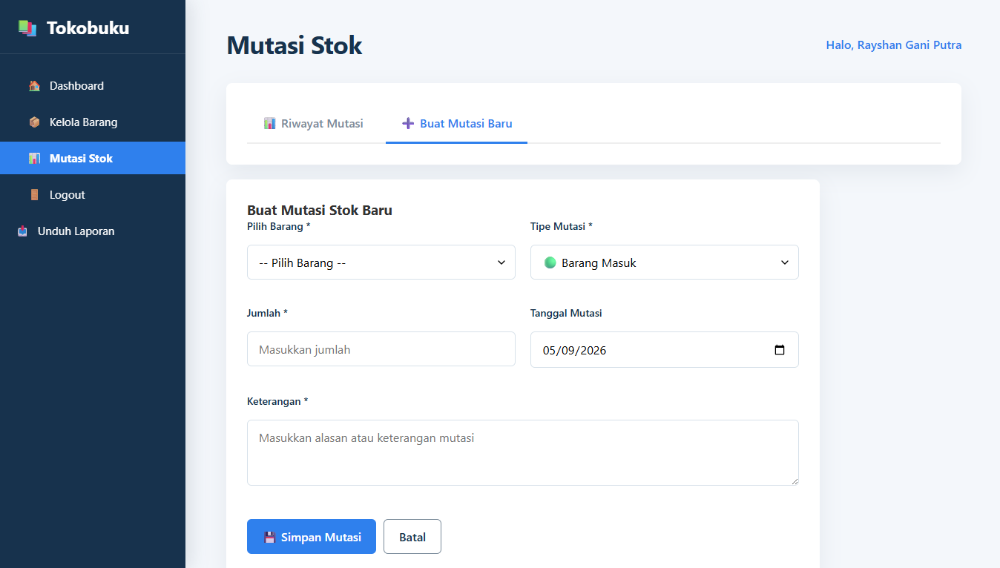   | 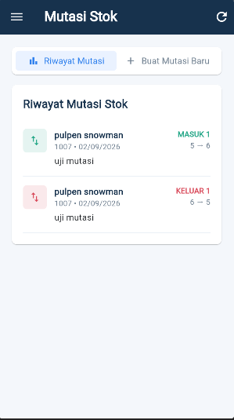 |
| Riwayat Mutasi   | 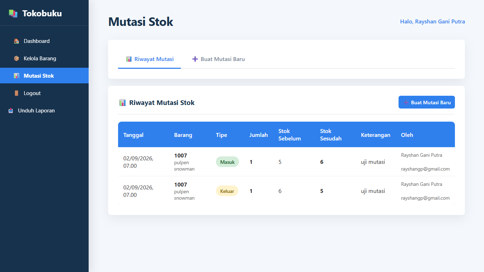 | -                                                         |

## Catatan Arsitektur

- React dan Flutter menggunakan backend API yang sama.
- Sistem menggunakan satu role admin sesuai kebutuhan proyek.
- Mutasi stok memakai update stok atomic agar request bersamaan tidak membuat stok negatif.
- MongoDB standalone lokal tidak mendukung transaction lintas collection. Untuk atomicity penuh antara histori mutasi dan stok, gunakan MongoDB replica set pada deployment production.

## Lisensi

Proyek ini dibuat untuk kebutuhan pembelajaran dan dokumentasi aplikasi inventaris.
